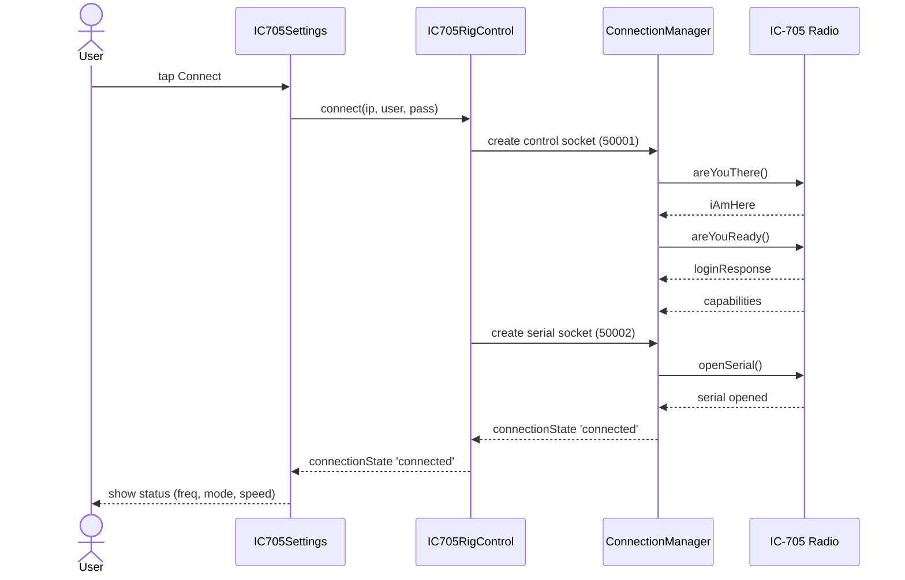
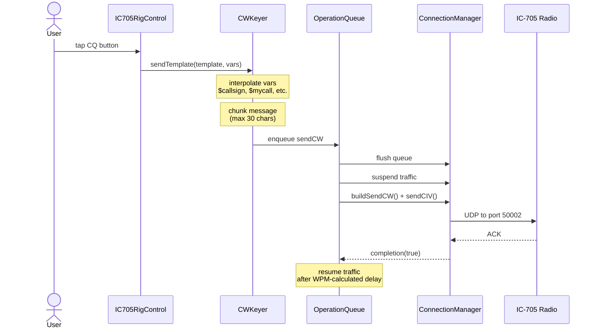
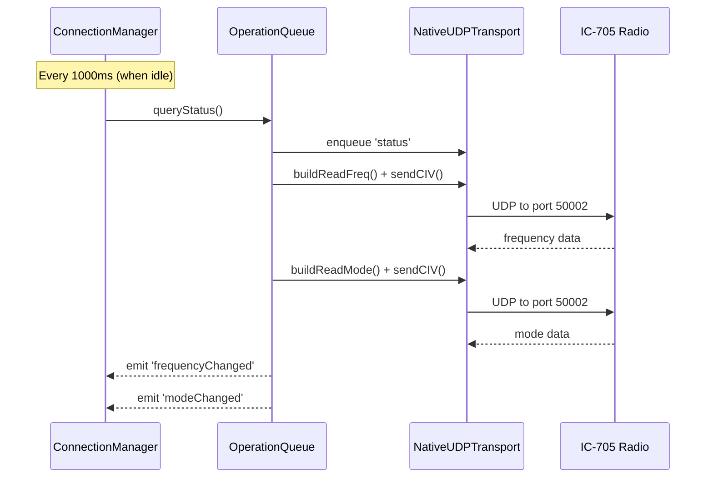

# IC-705 Rig Control Technical Implementation Guide

## Table of Contents

1. [Overview](#overview)
2. [Object Hierarchy](#object-hierarchy)
3. [JS/Swift Bridge Architecture](#jsswift-bridge-architecture)
4. [Sequence Diagrams](#sequence-diagrams)
5. [Data Flow Diagrams](#data-flow-diagrams)
6. [Protocol Stack](#protocol-stack)
7. [Native Module Registration](#native-module-registration)

---

## Overview

The IC-705 Rig Control module enables WiFi-based remote control of Icom IC-705 transceivers using the RS-BA1 protocol. The implementation spans JavaScript (React Native) and Swift (iOS native) layers, communicating via React Native's TurboModule bridge.

### Communication Architecture

```
┌─────────────────────────────────────────────────────────────────────────────┐
│                              JAVASCRIPT LAYER                                │
│  ┌──────────────┐  ┌──────────────┐  ┌──────────────┐  ┌─────────────────┐  │
│  │   UI Layer   │  │     Hook     │  │  Orchestrator│  │ Protocol Stack  │  │
│  │  Components  │──│   useIC705   │──│IC705RigCtrl  │──│ ConnectionMgr   │  │
│  │              │  │              │  │              │  │ OperationQueue  │  │
│  └──────────────┘  └──────────────┘  └──────────────┘  └─────────────────┘  │
└─────────────────────────────────────────────────────────────────────────────┘
                                       │
                                       │ calls
                                       ▼
┌─────────────────────────────────────────────────────────────────────────────┐
│                           TRANSPORT LAYER (JS)                               │
│                    ┌─────────────────────────────┐                          │
│                    │      NativeUDPTransport     │                          │
│                    │  - Socket lifecycle mgmt    │                          │
│                    │  - Base64 encoding/decoding │                          │
│                    │  - Event subscription       │                          │
│                    └──────────────┬──────────────┘                          │
└───────────────────────────────────┼─────────────────────────────────────────┘
                                    │
                                    │ React Native Bridge
                                    │ (TurboModule/RCTBridge)
                                    ▼
┌─────────────────────────────────────────────────────────────────────────────┐
│                         NATIVE LAYER (Swift/Obj-C)                           │
│  ┌────────────────────────────────────────────────────────────────────────┐  │
│  │                    UDPTransportBridge.m (Obj-C)                         │  │
│  │  - RCT_EXTERN_MODULE macro exports Swift class to RN                    │  │
│  └──────────────────────────────┬─────────────────────────────────────────┘  │
│                                 │                                           │
│  ┌──────────────────────────────▼─────────────────────────────────────────┐  │
│  │                    UDPTransport.swift (Swift)                           │  │
│  │  - NWConnection UDP socket management                                   │  │
│  │  - Base64 ↔ Data conversion                                             │  │
│  │  - Event emission via RCTEventEmitter                                   │  │
│  └─────────────────────────────────────────────────────────────────────────┘  │
└─────────────────────────────────────────────────────────────────────────────┘
                                    │
                                    │ UDP Datagrams
                                    ▼
┌─────────────────────────────────────────────────────────────────────────────┐
│                              NETWORK LAYER                                   │
│                    RS-BA1 Protocol (Ports 50001/50002)                      │
└─────────────────────────────────────────────────────────────────────────────┘
```

---

## Object Hierarchy

### JavaScript Object Hierarchy

```
TransportInterface (Abstract)
    └── NativeUDPTransport
        ├── _dataCallbacks: Function[]
        ├── _subscription: EmitterSubscription
        ├── createSocket(id)
        ├── send(id, host, port, data)
        ├── close(id)
        └── onData(callback): unsubscribe

EventEmitter (Base)
    └── ConnectionManager
        ├── transport: TransportInterface
        ├── operationQueue: OperationQueue
        ├── sessionState: SessionStateMachine
        ├── _controlConnection: { socketId, sequence, myId, remoteId }
        ├── _serialConnection: { socketId, sequence, myId, remoteId }
        ├── connect(ip, user, pass): Promise
        ├── disconnect(): Promise
        ├── sendCIV(frame, options)
        ├── enqueueSendCW(text, wpm): Promise
        └── queryStatus(): Promise<{frequency, mode}>

OperationQueue
    ├── _queue: Operation[]
    ├── _active: Operation
    ├── _sendCIV: Function
    ├── _flush: Function
    ├── _suspendTraffic: Function
    ├── _resumeTraffic: Function
    ├── enqueue(type, payload): Promise
    ├── handleResponse(type, value)
    ├── flushPending()
    └── cancelAll()

CWKeyer extends EventEmitter
    ├── _operations: CWOperation[]
    ├── _timer: Timeout
    ├── serialNumber: number
    ├── isSending: boolean
    ├── send(operations, wpm)
    ├── sendInterpolatedTemplate(template, vars, context)
    ├── cancelSend()
    └── _emitChunk(chunk, wpm, callback)

IC705RigControl (Singleton Facade)
    ├── _connectionManager: ConnectionManager
    ├── _keyer: CWKeyer
    ├── _frequencyHz: number
    ├── _mode: string
    ├── _cwSpeed: number
    ├── connect(ip, user, pass)
    ├── disconnect()
    ├── sendCW(text, wpm)
    ├── setCWSpeed(wpm)
    └── getStatus(): StatusSnapshot
```

### Swift/Objective-C Object Hierarchy

```
NSObject (Foundation)
    └── RCTEventEmitter (React Native)
            └── UDPTransport
                ├── sockets: [String: NWConnection]
                ├── queue: DispatchQueue
                ├── hasListeners: Bool
                ├── createSocket(_:resolver:rejecter:)
                ├── send(_:host:port:base64Data:resolver:rejecter:)
                ├── close(_:resolver:rejecter:)
                ├── startReceiving(id:connection:)
                └── supportedEvents() -> [String]

RCTBridgeModule (Protocol)
    └── Implemented by UDPTransport via RCT_EXTERN_MODULE macro

RCTDefaultReactNativeFactoryDelegate (RN 0.83+)
    └── Extended via ReactNativeDelegate+Modules.mm
        └── Method swizzling for getModuleClassFromName:
```

### React Component Hierarchy

```
IC705SettingsScreen (Screen)
    ├── useIC705() hook
    │   └── Subscribes to IC705RigControl events
    ├── Connection Section
    │   ├── Status display (frequency, mode, CW speed)
    │   └── Connect/Disconnect button
    ├── WiFi Mode Section
    │   ├── Home LAN toggle
    │   └── Field AP toggle
    ├── Connection Settings
    │   ├── IP Address input
    │   ├── Username input
    │   └── Password input
    └── CW Settings
        ├── Template input
        ├── Auto-send toggle
        └── Sidetone toggle

IC705StatusBar (Component)
    ├── Displays: connection state, frequency, mode, CW speed
    ├── Listens to: frequencyChanged, modeChanged, cwSpeedChanged
    └── Dispatches: setVFO() to Redux
```

---

## JS/Swift Bridge Architecture

### How Swift Code is Accessed from JavaScript

React Native provides several mechanisms for JavaScript to call native code. This implementation uses **TurboModules with method swizzling** for React Native 0.83+ compatibility.

#### 1. Native Module Interface Definition (Objective-C)

**File:** `ios/polorig/UDPTransportBridge.m`

```objc
#import <React/RCTBridgeModule.h>
#import <React/RCTEventEmitter.h>

// RCT_EXTERN_MODULE macro creates the bridge registration
@interface RCT_EXTERN_MODULE(UDPTransport, RCTEventEmitter)

// Each method exposed to JS uses RCT_EXTERN_METHOD
RCT_EXTERN_METHOD(createSocket:(NSString *)id
                  resolver:(RCTPromiseResolveBlock)resolve
                  rejecter:(RCTPromiseRejectBlock)reject)

RCT_EXTERN_METHOD(send:(NSString *)id
                  host:(NSString *)host
                  port:(NSInteger)port
                  base64Data:(NSString *)base64Data
                  resolver:(RCTPromiseResolveBlock)resolve
                  rejecter:(RCTPromiseRejectBlock)reject)

RCT_EXTERN_METHOD(close:(NSString *)id
                  resolver:(RCTPromiseResolveBlock)resolve
                  rejecter:(RCTPromiseRejectBlock)reject)

@end
```

**How it works:**
- `RCT_EXTERN_MODULE(UDPTransport, RCTEventEmitter)` declares that the Swift class `UDPTransport` extends `RCTEventEmitter`
- `RCT_EXTERN_METHOD` exposes Swift methods to JavaScript as async functions returning Promises
- Arguments are automatically marshalled between JS types and native types

#### 2. Swift Implementation

**File:** `ios/polorig/UDPTransport.swift`

```swift
@objc(UDPTransport)  // Exposes class to Objective-C runtime
class UDPTransport: RCTEventEmitter {

    // Required: Tell RN whether module needs main queue setup
    override static func requiresMainQueueSetup() -> Bool { false }

    // Required: Declare events that will be emitted to JS
    override func supportedEvents() -> [String]! {
        ["onUDPData"]
    }

    // Method exposed to JS via RCT_EXTERN_METHOD
    @objc func send(_ id: String, host: String, port: Int,
                    base64Data: String,
                    resolver resolve: @escaping RCTPromiseResolveBlock,
                    rejecter reject: @escaping RCTPromiseRejectBlock) {
        // Implementation...
    }

    // Emit events to JavaScript
    private func notifyDataReceived(id: String, data: Data) {
        let b64 = data.base64EncodedString()
        DispatchQueue.main.async {
            self.sendEvent(withName: "onUDPData",
                          body: ["id": id, "data": b64])
        }
    }
}
```

#### 3. TurboModule Registration (Method Swizzling)

**File:** `ios/polorig/ReactNativeDelegate+Modules.mm`

React Native 0.83+ with New Architecture requires explicit module registration. Since we cannot modify the generated `ReactNativeDelegate` class directly, we use **method swizzling**.

```objc
static IMP originalGetModuleClassIMP = NULL;

// Our replacement function
static Class udpTransportGetModuleClass(id self, SEL _cmd, const char *name) {
    if (name && strcmp(name, "UDPTransport") == 0) {
        Class udpClass = NSClassFromString(@"UDPTransport");
        if (udpClass) return udpClass;
    }
    // Call original implementation
    if (originalGetModuleClassIMP) {
        Class (*origFunc)(id, SEL, const char *) =
            (Class (*)(id, SEL, const char *))originalGetModuleClassIMP;
        return origFunc(self, _cmd, name);
    }
    return nil;
}

@implementation RCTDefaultReactNativeFactoryDelegate (UDPTransportHook)

+ (void)load {
    dispatch_async(dispatch_get_main_queue(), ^{
        Class targetClass = NSClassFromString(@"polorig.ReactNativeDelegate");
        if (!targetClass) {
            targetClass = [RCTDefaultReactNativeFactoryDelegate class];
        }

        SEL selector = @selector(getModuleClassFromName:);
        Method originalMethod = class_getInstanceMethod(targetClass, selector);

        // Save original implementation
        originalGetModuleClassIMP = method_getImplementation(originalMethod);

        // Replace with our implementation
        IMP newIMP = (IMP)udpTransportGetModuleClass;
        method_setImplementation(originalMethod, newIMP);
    });
}

@end
```

**Why method swizzling:**
- React Native 0.83+ generates `ReactNativeDelegate` at build time
- We cannot modify generated code, so we intercept method calls at runtime
- `+ (void)load` runs before `main()`, ensuring the hook is in place before RN starts
- We preserve the original implementation for all other modules

#### 4. JavaScript Module Resolution

**File:** `src/extensions/other/ic705/transport/NativeUDPTransport.js`

```javascript
function resolveNativeUDP() {
    if (Platform.OS !== 'ios') return null;

    // Try TurboModuleRegistry first (New Architecture)
    try {
        const turbo = TurboModuleRegistry?.get?.('UDPTransport');
        if (turbo) return turbo;
    } catch (e) {}

    // Try global.nativeModuleProxy (Bridgeless mode)
    try {
        const nmp = global.nativeModuleProxy;
        if (nmp?.UDPTransport) return nmp.UDPTransport;
    } catch (e) {}

    // Fall back to NativeModules (Old Architecture)
    if (NativeModules.UDPTransport) {
        return NativeModules.UDPTransport;
    }

    return null;
}
```

**Resolution order:**
1. **TurboModuleRegistry** - React Native New Architecture (Fabric + TurboModules)
2. **global.nativeModuleProxy** - Bridgeless mode (experimental)
3. **NativeModules** - Legacy bridge (older RN versions)

#### 5. Event Communication (Native → JS)

Events flow from Swift → JavaScript via `RCTEventEmitter`:

```
Swift: sendEvent(withName: "onUDPData", body: ["id": id, "data": b64])
              │
              ▼
React Native Bridge (C++ layer)
              │
              ▼
JS: emitter.addListener('onUDPData', (event) => { ... })
```

**Subscription lifecycle:**
```javascript
// JavaScript
const emitter = new NativeEventEmitter(NativeUDP);
const subscription = emitter.addListener('onUDPData', (event) => {
    const data = fromBase64(event.data);
    // Process received data...
});

// Cleanup
subscription.remove();
```

---

## Sequence Diagrams

### 1. Connection Establishment Sequence



### 2. CW Send Sequence



### 3. Frequency Polling Sequence



---

## Data Flow Diagrams

### Cross-Boundary Data Flow (JS ↔ Swift)

```
┌─────────────────────────────────────────────────────────────────────────────┐
│                           SENDING DATA: JS → Radio                          │
└─────────────────────────────────────────────────────────────────────────────┘

JavaScript                          Swift                          Network
──────────                          ─────                          ───────
   │                                  │                               │
   │ 1. Build CI-V frame             │                               │
   │    Uint8Array [0xFE, 0xFE, ...] │                               │
   │                                  │                               │
   │ 2. Convert to base64            │                               │
   │    "FeFeA4E003..."              │                               │
   │                                  │                               │
   │ 3. Call native method           │                               │
   │    NativeUDP.send(id, host,     │                               │
   │                 port, b64)      │                               │
   │──────────────┐                  │                               │
   │              │                  │                               │
   │              ▼                  │                               │
   │         ┌─────────────────────────────────────┐                  │
   │         │ React Native Bridge (JSC/Hermes)   │                  │
   │         │ - Marshal JS string → NSString     │                  │
   │         │ - Async dispatch to native queue   │                  │
   │         └─────────────────────────────────────┘                  │
   │                  │                                               │
   │                  ▼                                               │
   │            ┌──────────┐                                          │
   └───────────>│ UDPTransport.send()                                │
                │ - base64Data: String                               │
                └─────┬─────┘                                          │
                      │                                                │
                      ▼                                                │
                ┌─────────────────────────────────────┐                 │
                │ Data(base64Encoded: base64Data)    │                 │
                │ Convert base64 → Data (bytes)      │                 │
                └─────────────┬───────────────────────┘                 │
                              │                                        │
                              ▼                                        │
                ┌─────────────────────────────────────┐                 │
                │ NWConnection.send(content:)        │                 │
                │ Network framework UDP socket       │                 │
                └─────────────┬───────────────────────┘                 │
                              │                                        │
                              ▼                                        ▼
                         UDP Datagram ────────────────────────────────>│
                         Port 50001/50002                              │
                                                                        │
┌─────────────────────────────────────────────────────────────────────────────┐
│                          RECEIVING DATA: Radio → JS                         │
└─────────────────────────────────────────────────────────────────────────────┘

Network                         Swift                           JavaScript
───────                         ─────                           ──────────
   │                              │                                │
   │ UDP Datagram                 │                                │
   │<──────────────────────────────────────────────────────────────│
   │                              │                                │
   │                              │ connection.receiveMessage()   │
   │                              │ (async callback)              │
   │                              │                                │
   │                              │ Data received                  │
   │                              │                                │
   │                              │ data.base64EncodedString()    │
   │                              │ "FeFeE0A403..."               │
   │                              │                                │
   │                              │ sendEvent(withName:           │
   │                              │   "onUDPData",                 │
   │                              │   body: [id, data])           │
   │                              │                                │
   │                              │  ┌───────────────────────────────────────────┐
   │                              │  │ RCTEventEmitter                           │
   │                              │  │ - Marshal NSString → JS string            │
   │                              │  │ - Dispatch to JS thread                   │
   │                              │  └───────────────────────────────────────────┘
   │                              │                │
   │                              │                ▼
   │                              │    ┌─────────────────┐
   │                              └────┤ onUDPData event │
   │                                   │ emitted         │
   │                                   └────────┬────────┘
   │                                            │
   │                                            ▼
   │                              ┌──────────────────────────────┐
   │                              │ NativeEventEmitter (JS)      │
   │                              │ emitter.addListener()        │
   │                              └─────────────┬────────────────┘
   │                                            │
   │                                            ▼
   │                              ┌──────────────────────────────┐
   └──────────────────────────────│ fromBase64(event.data)       │
                                  │ Uint8Array [0xFE, 0xFE, ...] │
                                  └─────────────┬────────────────┘
                                                │
                                                ▼
                                  ┌──────────────────────────────┐
                                  │ parseCIVResponse()           │
                                  │ Extract command, payload     │
                                  └─────────────┬────────────────┘
                                                │
                                                ▼
                                  ┌──────────────────────────────┐
                                  │ Emit 'frequencyChanged'      │
                                  │ or 'modeChanged' event       │
                                  └──────────────────────────────┘
```

### Data Transformation Pipeline

```
┌─────────────────────────────────────────────────────────────────────────────┐
│                              OUTGOING CI-V COMMAND                          │
└─────────────────────────────────────────────────────────────────────────────┘

High-Level Command                    Wire Format
──────────────────                    ───────────

readFrequency()           ───┐
                             │
    buildFrame(0x03)       ──┼──►  FE FE A4 E0 03 FD
                             │     ││ ││ ││ ││ ││
                             │     ││ ││ ││ ││ └┴── Terminator (0xFD)
                             │     ││ ││ │└┴┴────── Command (0x03)
                             │     ││ │└┴───────── From (0xE0 = controller)
                             │     │└┴──────────── To (0xA4 = radio)
                             │     └┴───────────── Preamble (0xFE FE)
                             │
buildSendCW("CQ")         ───┤
                             │
    buildFrame(0x17,        ─┼──►  FE FE A4 E0 17 43 51 FD
    [0x43, 0x51])              │     ││ ││ ││ ││ ││  ││  ││
    ("C", "Q")                 │     ││ ││ ││ ││ └┴──┴┴──┴┴── Payload (ASCII)
                               │     └┴─┴┴─┴┴─┴┴──────────────── Preamble + Header

┌─────────────────────────────────────────────────────────────────────────────┐
│                              INCOMING CI-V RESPONSE                         │
└─────────────────────────────────────────────────────────────────────────────┘

Wire Format                       Parsed Structure
───────────                       ────────────────

FE FE E0 A4 03                    ───┐
07 07 40 00 00 FD                   │
                                    │    parseCIVResponse()
││ ││ ││ ││ ││                      │         │
││ ││ ││ ││ └┴──────────────────────┘         │
││ ││ ││ │└┴──────────────────────────────────┼──► command: 0x03 (readFrequency)
││ ││ │└┴─────────────────────────────────────┼──► source: 0xA4 (radio)
││ │└┴────────────────────────────────────────┼──► destination: 0xE0 (controller)
│└┴───────────────────────────────────────────┼──► preamble: valid
└─────────────────────────────────────────────┼──► payload: [0x07, 0x07, 0x40, 0x00, 0x00]
                                              │
                                              ▼
                                    parseFrequencyHz(payload)
                                              │
                                              ▼
                                    0x0707400000 (BCD)
                                              │
                                              ▼
                                    7,074,000 Hz = 7.074 MHz
```

---

## Protocol Stack

### RS-BA1 Protocol Layers

```
┌─────────────────────────────────────────────────────────────────────────────┐
│                           APPLICATION LAYER                                  │
│  ┌──────────────────────────────────────────────────────────────────────┐   │
│  │  CI-V Commands (sendCW, readFrequency, setMode, etc.)               │   │
│  │  File: CIVProtocol.js                                               │   │
│  └──────────────────────────────────────────────────────────────────────┘   │
├─────────────────────────────────────────────────────────────────────────────┤
│                           SERIAL PORT LAYER                                  │
│  ┌──────────────────────────────────────────────────────────────────────┐   │
│  │  RS-BA1 CIV Packets (cmd: 0xC1, length, sequence, data)             │   │
│  │  Port: 50002 (CI-V data)                                            │   │
│  │  File: RSBA1Protocol.js - civPacket(), parseCIVFromSerial()         │   │
│  └──────────────────────────────────────────────────────────────────────┘   │
├─────────────────────────────────────────────────────────────────────────────┤
│                           CONTROL PORT LAYER                                 │
│  ┌──────────────────────────────────────────────────────────────────────┐   │
│  │  RS-BA1 Control Packets (areYouThere, login, capabilities, ping)    │   │
│  │  Port: 50001 (control/auth)                                         │   │
│  │  File: RSBA1Protocol.js - controlPacket(), loginPacket(), etc.      │   │
│  └──────────────────────────────────────────────────────────────────────┘   │
├─────────────────────────────────────────────────────────────────────────────┤
│                           TRANSPORT LAYER                                    │
│  ┌──────────────────────────────────────────────────────────────────────┐   │
│  │  UDP Datagrams (NWConnection in Swift)                              │   │
│  │  Files: UDPTransport.swift, NativeUDPTransport.js                   │   │
│  └──────────────────────────────────────────────────────────────────────┘   │
├─────────────────────────────────────────────────────────────────────────────┤
│                           NETWORK LAYER                                      │
│  ┌──────────────────────────────────────────────────────────────────────┐   │
│  │  IP + UDP (iOS Network framework)                                   │   │
│  │  Radio IP: 192.168.59.1 (Field AP) or home LAN IP                   │   │
│  └──────────────────────────────────────────────────────────────────────┘   │
└─────────────────────────────────────────────────────────────────────────────┘
```

### Packet Structure Reference

**Control Packet (Port 50001):**
```
 0                   1                   2                   3
 0 1 2 3 4 5 6 7 8 9 0 1 2 3 4 5 6 7 8 9 0 1 2 3 4 5 6 7 8 9 0 1
+-+-+-+-+-+-+-+-+-+-+-+-+-+-+-+-+-+-+-+-+-+-+-+-+-+-+-+-+-+-+-+-+
|                           Length                              |
+-+-+-+-+-+-+-+-+-+-+-+-+-+-+-+-+-+-+-+-+-+-+-+-+-+-+-+-+-+-+-+-+
|           Type                |          Sequence             |
+-+-+-+-+-+-+-+-+-+-+-+-+-+-+-+-+-+-+-+-+-+-+-+-+-+-+-+-+-+-+-+-+
|                           SendId                              |
+-+-+-+-+-+-+-+-+-+-+-+-+-+-+-+-+-+-+-+-+-+-+-+-+-+-+-+-+-+-+-+-+
|                           RecvId                              |
+-+-+-+-+-+-+-+-+-+-+-+-+-+-+-+-+-+-+-+-+-+-+-+-+-+-+-+-+-+-+-+-+
```

**CI-V Packet (Port 50002):**
```
 0                   1                   2                   3
 0 1 2 3 4 5 6 7 8 9 0 1 2 3 4 5 6 7 8 9 0 1 2 3 4 5 6 7 8 9 0 1
+-+-+-+-+-+-+-+-+-+-+-+-+-+-+-+-+-+-+-+-+-+-+-+-+-+-+-+-+-+-+-+-+
|                           Length                              |
+-+-+-+-+-+-+-+-+-+-+-+-+-+-+-+-+-+-+-+-+-+-+-+-+-+-+-+-+-+-+-+-+
|           Type                |          Sequence             |
+-+-+-+-+-+-+-+-+-+-+-+-+-+-+-+-+-+-+-+-+-+-+-+-+-+-+-+-+-+-+-+-+
|                           SendId                              |
+-+-+-+-+-+-+-+-+-+-+-+-+-+-+-+-+-+-+-+-+-+-+-+-+-+-+-+-+-+-+-+-+
|                           RecvId                              |
+-+-+-+-+-+-+-+-+-+-+-+-+-+-+-+-+-+-+-+-+-+-+-+-+-+-+-+-+-+-+-+-+
|  Cmd  |      Length       |   Seq   |
+-+-+-+-+-+-+-+-+-+-+-+-+-+-+-+-+-+-+-+-+-+-+-+-+-+-+-+-+-+-+-+-+
|                     CI-V Frame Data ...                       |
+-+-+-+-+-+-+-+-+-+-+-+-+-+-+-+-+-+-+-+-+-+-+-+-+-+-+-+-+-+-+-+-+
```

**CI-V Frame:**
```
+--------+--------+--------+--------+--------+--------+--------+--------+
|  0xFE  |  0xFE  |  To    |  From  | Command|  Data  |  ...   |  0xFD  |
+--------+--------+--------+--------+--------+--------+--------+--------+
| Preamble         | Dest   | Source | Cmd    | Payload       | Term   |
+--------+--------+--------+--------+--------+--------+--------+--------+
```

---

## Native Module Registration

### Summary of Bridge Mechanism

The Swift `UDPTransport` module is made accessible to JavaScript through a multi-layer registration system:

| Layer | File | Purpose |
|-------|------|---------|
| **Swift Implementation** | `UDPTransport.swift` | Native UDP socket logic using `NWConnection` |
| **Bridge Interface** | `UDPTransportBridge.m` | Objective-C++ header exposing Swift to RN via `RCT_EXTERN_MODULE` |
| **Runtime Registration** | `ReactNativeDelegate+Modules.mm` | Method swizzling to register with TurboModule system |
| **JS Resolution** | `NativeUDPTransport.js` | Multi-path module resolution for compatibility |

### Key Technical Details

1. **Base64 Encoding**: All binary data crosses the bridge as base64 strings because the React Native bridge only supports JSON-serializable types (no direct Uint8Array transfer).

2. **Event-Driven Receives**: Since UDP is connectionless and asynchronous, received data flows via events (`onUDPData`) rather than return values.

3. **Promise-Based Sends**: Send operations return Promises that resolve when the data is handed to the OS network stack (not when acknowledged by the radio).

4. **Automatic Reconnection**: The `NWConnection` framework handles local network interface changes automatically.

5. **Dispatch Queue**: All Swift socket operations occur on a dedicated `DispatchQueue` (not the main thread) to avoid blocking UI.

### Troubleshooting Bridge Issues

If the native module is not available:

1. Check that `UDPTransportBridge.m` is compiled (in Build Phases)
2. Verify `ReactNativeDelegate+Modules.mm` is linked
3. Check Xcode console for "[UDPTransport]" log messages
4. Ensure Swift standard libraries are included (iOS 12+ requirement)
5. Verify `localhost:8082` is accessible (Metro bundler port)

---

## Related Documentation

- `IC705_ARCHITECTURE.md` - High-level component overview
- `PRODUCTION_READINESS_PLAN.md` - Testing and deployment checklist
- `REBUILD_PLAN.md` - Migration from native to JS implementation notes
